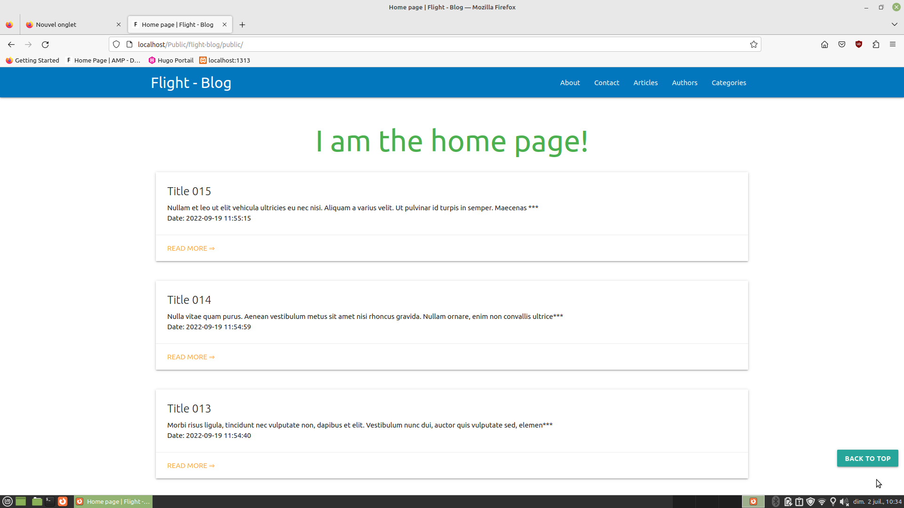

# flight-mysql

Exercise of understanding and application of the php [Flight](https://flightphp.com/) framework, by carrying out a CRUD only for educational purposes.

Exercice de compréhension et de mise en application du framework php [Flight](https://flightphp.com/), en réalisant un CRUD uniquement dans le but éducatif.

## Installation

Mysql data needed to try `flight-mysql_sql`

## Usage

## Contributing
[makeareadme](https://www.makeareadme.com/)

## License
[Unlicense](https://choosealicense.com/licenses/unlicense/)
